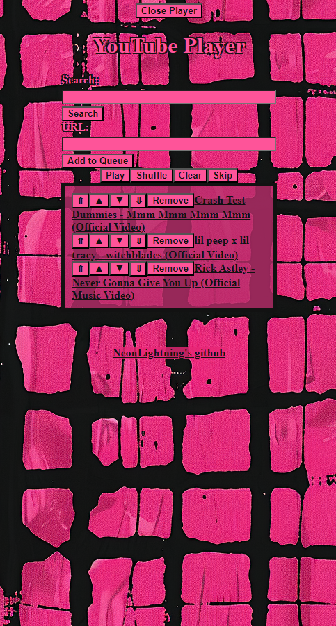
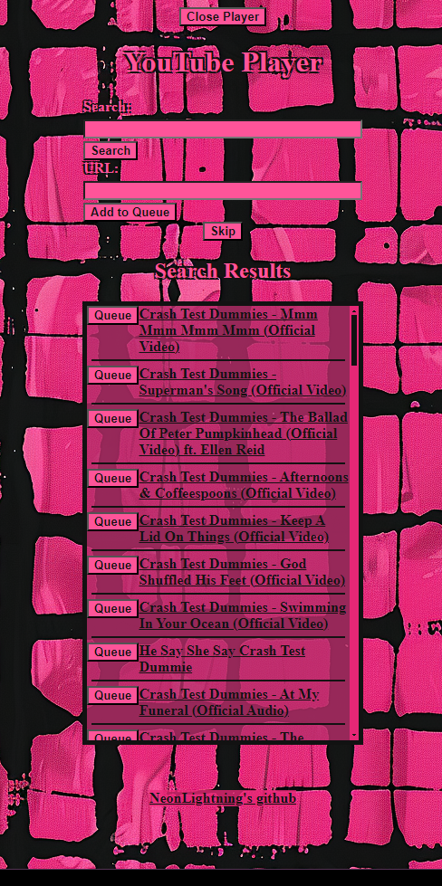
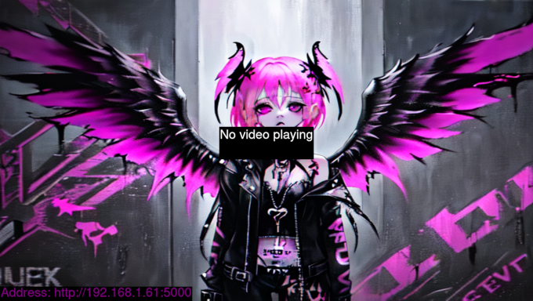
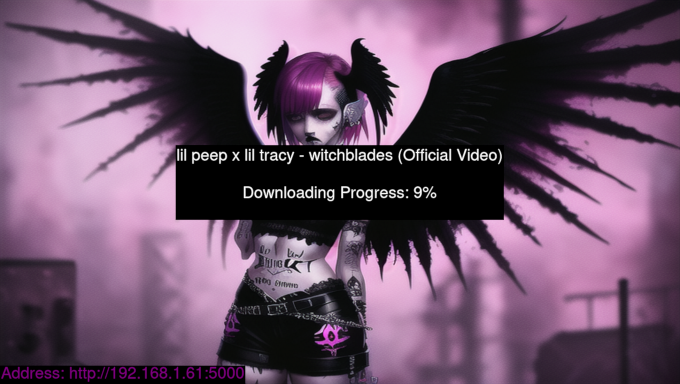

# YouTube Player Application

This Flask application allows you to and play YouTube videos sequentially. It manages a video queue, displays search results on a separate page, and updates the queue with new items while playing. The application also displays the title of the next video before it is played.

run using `python3 ./player.py'

first run it will ask in console for you to authenticate

this will only happen the first time you run. it's to bypass age restrictions.

it will ask for a new one when you encounter an age restricted video if the token changes though.

this is only until i figure out an age bypass.

it will install required dependancies if not found but requires setuptools. if you want to skip this step and install the deps yourself just change false to true in config.ini is_setup_done.

if you want a background there is rudimentary functionality for it. just place a png files in /files/backgrounds and it'll scale to your screen.

## Screenshots

