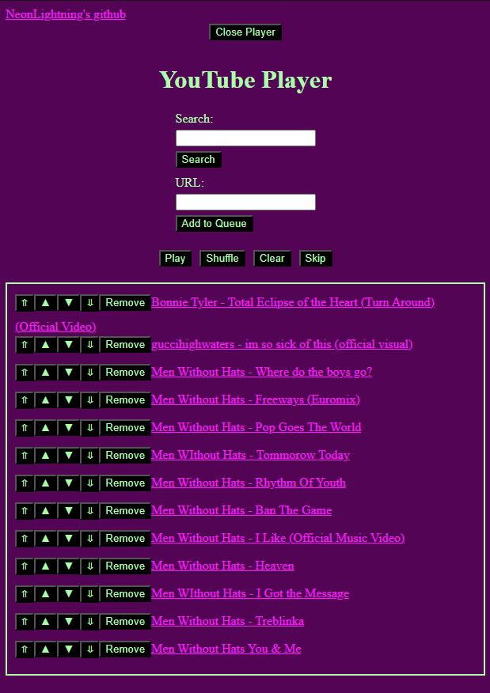
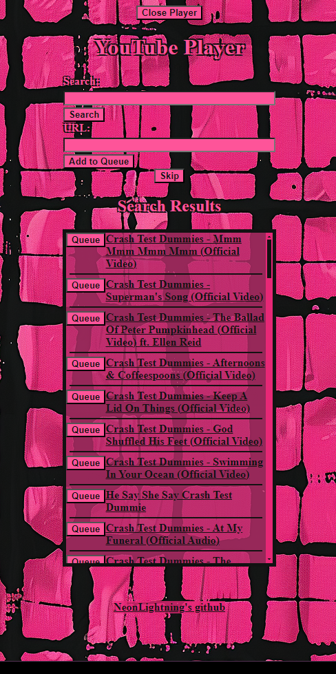

# YouTube Player Application

This Flask application allows you to download and play YouTube videos sequentially. It manages a video queue, displays search results on a separate page, and updates the queue with new items while playing. The application also displays the title of the next video before it is downloaded.

run using `python3 ./player.py'

it will install required dependancies if not found.

on first encounter of a age restricted video you will need to follow the instructions output to console. but after that it won't be needed.

## Screenshots

